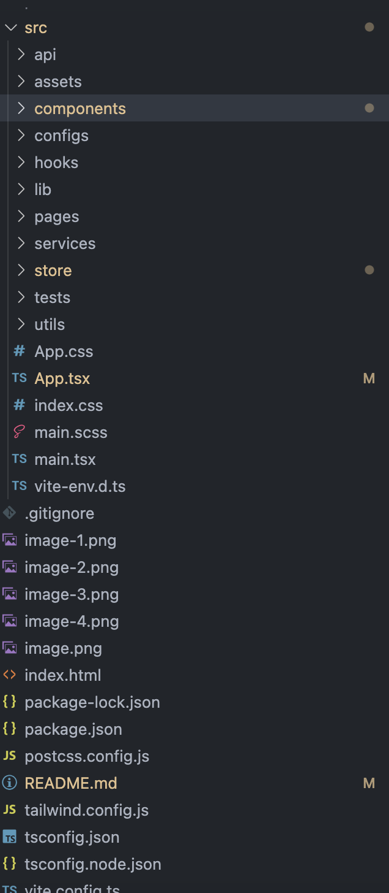

# Merhaba Eteration IT ekibi 👋 😎

Bu Readme file'ı sizin için yazıyorum.

Comman Lines: (Projeyi ayağa kaldırmak için) 

1. npm i - Paketleri yüklemek için  
2. npm run dev - Ayağa kaldırmak için projeyi  
3. npm run test - Test case'leri check etmek için

Kullandığım teknolojiler:

1. Vite ile oluşturdum bu React projesini (JavaScript + TypeScript).
2. Tailwind, SCSS (evet ikisinide aynı anda kullandım daha faydalı olduğunu düşünüyorum 😎)
3. Flowbite UI library
4. Redux - Redux Toolkit
5. Vitest (Test yazmak için kullandım)
6. Açıklamada belirttiğiniz case'de olması gereken bütün özelikkleri eksiksiz kodladım.

      
   
      
   
      
   
      
   
      
   

Folder Structure
  

